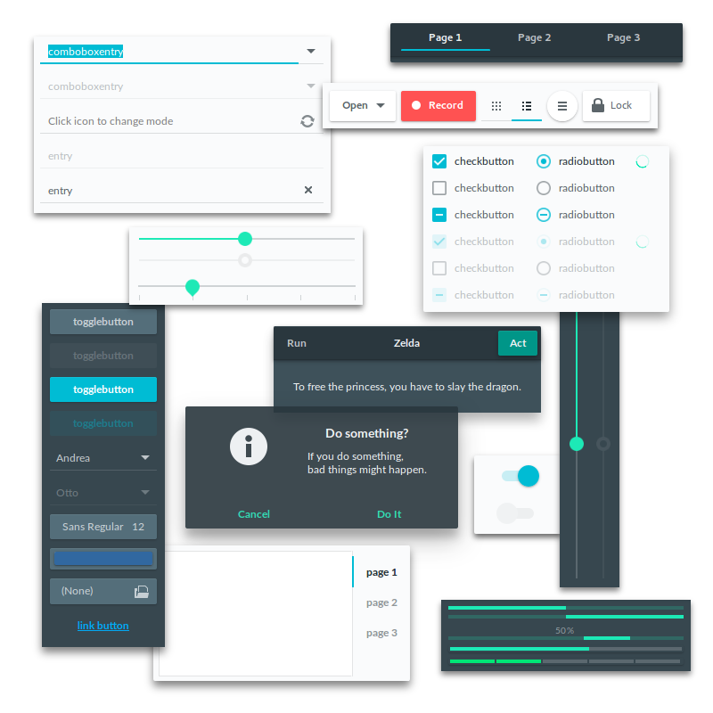

Adapta
=========

An adaptive Gtk+ theme based on Material Design Guidelines.
Lots of elements are forked from Flat-Plat: https://github.com/nana-4/Flat-Plat

Elements
--------


Required Components
-------------------
Adapta supports Gtk+ 3.20.x (and 3.18.x)

 ```
 * Gtk+-3.0            >= 3.20.0 (or 3.18.4)
 * Gtk+-2.0            >= 2.24.30 (or 2.24.29)
 * gtk2-engines-pixbuf >= 2.24.30 (or 2.24.29)
 ```

Supported Desktop Environments
------------------------------

 ```
 * GNOME           >= 3.20 (or 3.18)
 * GNOME-Flashback >= 3.18.0
 * Budgie-Desktop  >= 10.2.4
 * Unity7          >= 7.4.0
 * Cinnamon        >= 2.8
 * XFce4           >= 4.12.2
 ```

 Unity, Cinnamon and XFce support are under W.I.P state.

Unsupported Gtk+ Based Desktops
-------------------------------
 * Mate
 * Pantheon

Installation from PPA (Ubuntu 16.04 LTS only)
------------
1. Run

 ```
 sudo apt-add-repository ppa:tista/adapta -y
 sudo apt update
 sudo apt install adapta-gtk-theme
 ```

2. select `Adapta` via Gnome-Tweak-Tool.

 * For Gtk+ 3.18.x users, there's no need to upgrade Gnome-Tweak-Tool to 3.20.0 since Adapta revived `gtk-3.0` directory.

Installation from Git Source
------------
1. Check `autoconf`, `automake` and `pkg-config` (`pkgconfig`) are installed.

2. Build and install system-wide:

 ```
 ./autogen.sh
 make
 sudo make install
 ```

 * Default prefix is `/usr`
 * `make` actually does nothing (for future release)
 * `sudo make install` installs multiple versioned theme and Gtk+ automatically selects proper versioned one when running.

3. If users want to disable some DE supports, please pass these specific options to `autogen.sh`:

 ```
 --disable-cinnamon      disable cinnamon support
 --disable-flashback     disable flashback support
 --disable-unity         disable unity support
 --disable-xfce          disable xfce support
 ```

 * Installer installs GNOME/Budgie-Desktop support even if all of options above were applied.
 * Cinnamon/Unity support hooks `metacity-1` directory even if GNOME-Flashback support was disabled.

Work in Progress
----------------
* Conversion to Gtk+ git master
* XFce4 integration

TODO
----

Public License
--------------
 GPLv2

Special Thanks to
--------------
 Nana-4, the developer of Flat-Plat.
