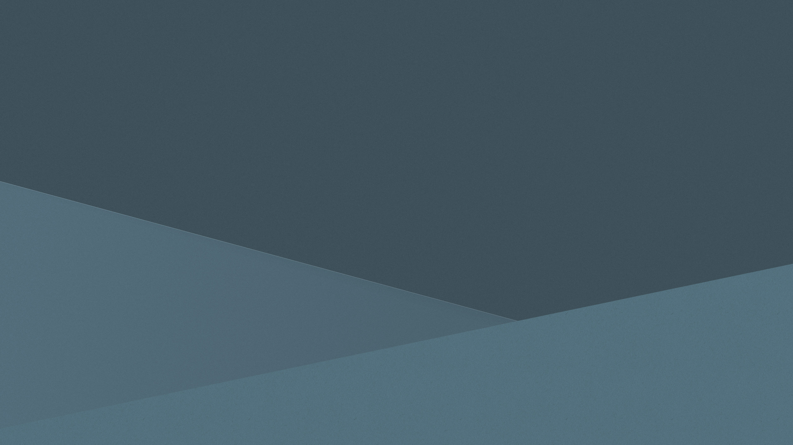

Adapta
=========

An adaptive Gtk+ theme based on Material Design Guidelines.
Lots of elements were forked from [Flat-Plat](https://github.com/nana-4/Flat-Plat) at the start.

 `Adapta`:
 * Light/Dark variant Gtk+ 3.20/3.18 theme
 * Light/Dark variant Budgie-Desktop theme
 * Light variant Gtk+ 2.0 theme
 * Light variant Gnome-Shell theme
 * Light variant Cinnamon theme

 `Adapta-Nokto`:
 * Light/Dark variant Gtk+ 3.20/3.18 theme
 * Light/Dark variant Budgie-Desktop theme
 * Dark variant Gtk+ 2.0 theme
 * Dark variant Gnome-Shell theme
 * Dark variant Cinnamon theme


> **Note:** Both also includes common GNOME-Flashback, Unity7 and XFce4 theming.

Elements
--------


Required Components
-------------------
Adapta supports Gtk+ 3.20.x and 3.18.x

 ```
 * Gtk+-3.0             >= 3.20.1  (or  3.18.9)
 * Gtk+-2.0             >= 2.24.30
 * gtk2-engines-pixbuf  >= 2.24.30
 * gtk2-engines-murrine >= 0.98.2
 ```

Supported Desktop Environments
------------------------------

 ```
 * GNOME           >= 3.20 (or 3.18)
 * GNOME-Flashback >= 3.18.0
 * Budgie-Desktop  >= 10.2.4
 * Unity7          >= 7.4.0
 * Cinnamon        >= 3.0.1 (or 2.8.6)
 * XFce4           >= 4.12.2
 ```

 > **Note:** Cinnamon support is under W.I.P state.

Unsupported Gtk+ Based Desktops
-------------------------------
 * Mate
 * Pantheon

Installation from PPA (Ubuntu 16.04 LTS and 16.10)
------------
1. Run

 ```
 sudo apt-add-repository ppa:tista/adapta -y
 sudo apt update
 sudo apt install adapta-gtk-theme
 ```

2. select `Adapta` or `Adapta-Nokto` via Gnome-Tweak-Tool.

 > **Note:**
 >
 >   * `Adapta-Nokto` is for dark variant of Gtk+ 2.0 theming:
 >     * `Adapta` + `global dark theme = off` make all light variant.
 >     * `Adapta` + `global dark theme = on` make dark variant Gtk+3 and light variant Gtk+2.
 >     * `Adapta-Nokto` + `global dark theme = off` make light variant Gtk+3 and dark variant Gtk+2.
 >     * `Adapta-Nokto` + `global dark theme = on` make dark variant.
 >
 >   * For Gtk+ 3.18.x users, there's no need to upgrade Gnome-Tweak-Tool to 3.20.0 since Adapta revived `gtk-3.0` directory.
 >   * As default, Gtk+ 3.21.x support is disabled.
 >   * When updating package, Adapta automatically does cleaning up pre-installed directories.

Installation from Git Source
------------
1. If previous version was installed/existed, remove them at first.

 ```
 sudo rm -rf /usr/share/themes/{Adapta,Adapta-Nokto}
 rm -rf ~/.local/share/themes/{Adapta,Adapta-Nokto}
 rm -rf ~/.themes/{Adapta,Adapta-Nokto}
 ```

2. Check `autoconf`, `automake` and `pkg-config` (`pkgconfig`) are installed.

3. Build and install system-wide:

 ```
 ./autogen.sh
 make
 sudo make install
 ```

 > **Note:**
 >   * Default prefix is `/usr`
 >   * `Adapta-Nokto` Gtk+ 2.0 dark variant is installed as default
 >   * `make` actually does nothing (for future release)
 >   * `sudo make install` installs multiple versioned theme and Gtk+ automatically selects proper versioned one when running.

4. If users want to disable some DE supports, please pass these specific options to `autogen.sh`:

 ```
 --disable-cinnamon      disable cinnamon support
 --disable-flashback     disable flashback support
 --disable-unity         disable unity support
 --disable-xfce          disable xfce support
 ```

 > **Note:**
 >   * Installer installs GNOME/Budgie-Desktop support even if all of options above were applied.
 >   * Cinnamon/Unity support hooks `metacity-1` directory even if GNOME-Flashback support was disabled.

5. If users want to enable next Gtk+ release support, please pass this option:

 ```
 --enable-gtk_next       enable Gtk+ 3.21.x support
 ```

 > **Note:**
 >   * As default, Gtk+ 3.21.x support is disabled.

Extra Browser Support
---------------------
 If users want to try experimental browser specific theming, please pass this option:

 ```
 --enable-chrome         enable Chrome(ium) support
 ```

 The compressed `crx` files will be installed into `Adapta/chrome` and `Adapta-Nokto/chrome`.

 > **Note:**
 >   * Today Chrome(ium) theming is supported only.

Official Wallpaper of Adapta
----------------------------


 * Resolution: 3840 x 2160 (4K = 2160p)
 * Created with Gimp and Inkscape
 * License under GPLv2

I mainly use it when running Budgie, and it might be suitable for night owls...

Work in Progress
----------------
* Conversion to Gtk+ 3.22

TODO
----
* Prepare for Steam theming (priority: Low)
* Add Firefox specific theming (priority: undecided)

Public License
--------------
 GPLv2

Special Thanks to
--------------
 Nana-4, the developer of Flat-Plat.
